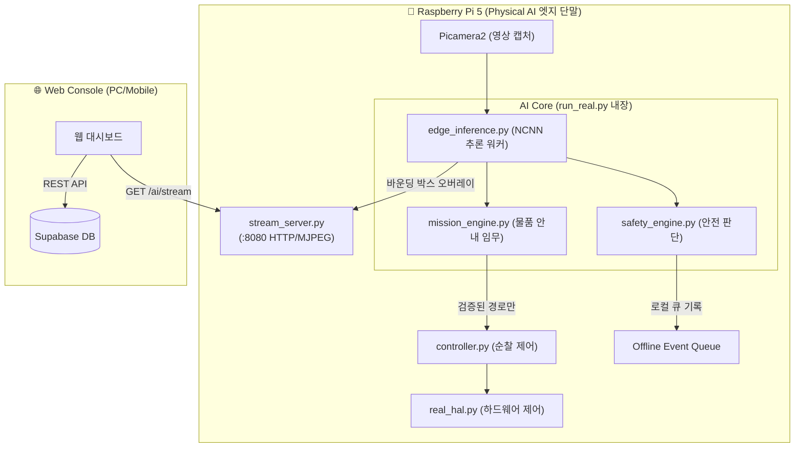

# LabKeeper: Physical AI (엣지 일체형) 아키텍처

> **상태 안내:** 이 문서는 목표 구조를 설명하는 개념 문서이며 현재 구현 완료 보고서가 아니다. 실제 구현 상태, 모델 선택, 단계별 통과 조건은 `PHYSICAL_AI_EDGE_TRANSITION_PLAN.md`를 최우선으로 따른다.

본 문서는 LabKeeper의 목표 아키텍처인 **"라즈베리파이 단독(일체형) Physical AI"** 구조를 설명합니다. 기존의 PC 관제 서버를 거치는 방식(Edge-Cloud 분산형)에서 벗어나, 로봇 자체가 스스로 보고 판단하는 순수 엣지 컴퓨팅 기반으로 재설계되었습니다.

## 1. 아키텍처 개요

로봇(Raspberry Pi 5) 내부에서 영상 캡처, 객체 탐지(YOLO), 안전 판단과 주행 제어를 수행합니다. PC는 모델 학습·Isaac Sim·웹 관제와 오프라인 이벤트 중계를 맡지만 현장 판단 루프에는 참여하지 않습니다.

## 2. 주요 변경 사항 및 기술적 과제

### 2.1 통합 메인 루프 (`run_real.py`)
- 기존: 영상을 HTTP 스트림으로 쏘기만 함.
- **변경:** `FrameBroker`가 카메라를 한 번만 열고 최신 프레임을 원본 스트림·NCNN 워커·QR 스캐너에 공유한다. AI 워커는 제어 루프와 별도 스레드에서 실행되며 Shadow Mode에서는 모터 명령을 만들지 않는다.

### 2.2 영상 스트리밍 통합 (`stream_server.py`)
- 기존: 로봇은 원본 영상만 송출, PC가 AI HUD를 그려서 8081 포트로 재송출.
- **변경:** 로봇 내부에서 YOLO 분석이 끝난 프레임에 바운딩 박스를 렌더링한 후, 로봇 자체의 8080 포트 `/ai/stream`으로 직접 송출한다. PC 관제 서버는 운영 경로에서 제외한다.

### 2.3 YOLO 경량화와 반응성 분리
Pi 운영 환경에는 PyTorch 대신 NCNN을 사용한다. 카메라와 제어 루프를 AI 지연에서 분리하고 지연된 프레임 큐를 만들지 않는 구조를 사용한다.

- **최신 프레임 방식:** 워커가 처리할 수 있는 시점의 가장 최신 프레임 하나만 가져온다. 오래된 프레임을 순서대로 처리하거나 이전 바운딩 박스를 임의 보간하지 않는다.
- **독립 주기:** 주행 안전 제어 20 Hz, 원본 카메라 약 30 FPS, AI 운영 목표 10 FPS를 각각 독립적으로 유지한다.
- **모델 변환:** 사람과 연구실 물품을 통합한 YOLO11 nano를 `NCNN`으로 변환했으며 Pi 5에서 순수 추론 약 25.6 FPS를 측정했다.
- **MOG2 역할 제한:** 고정 대기 중 움직임을 야간 재확인 트리거로만 사용한다. 이동 중 영상 변화는 사람 판정으로 사용하지 않는다.

## 3. 데이터 흐름 (야간 방범 시나리오)

1. **카메라 캡처**: Picamera2가 실시간 영상을 메모리 버퍼에 기록.
2. **움직임 트리거**: 고정 대기 상태의 가벼운 움직임 감지가 재확인을 요청한다.
3. **AI 분석**: NCNN 워커의 최신 결과에서 사람 후보를 확인한다.
4. **안전 판단**: 초음파와 모드 우선순위를 먼저 적용하고, 검증되지 않은 AI 결과에는 모터 권한을 주지 않는다.
5. **Shadow Mode 액션**: 현재는 상태·스냅샷·로컬 이벤트만 기록한다. 사람 자동 추적과 부저 구동은 실제 연구실 데이터 검증 후 별도 승인한다.
6. **관제 송출**: 분석 결과를 `stream_server.py`의 `/ai/stream`으로 송출한다.
