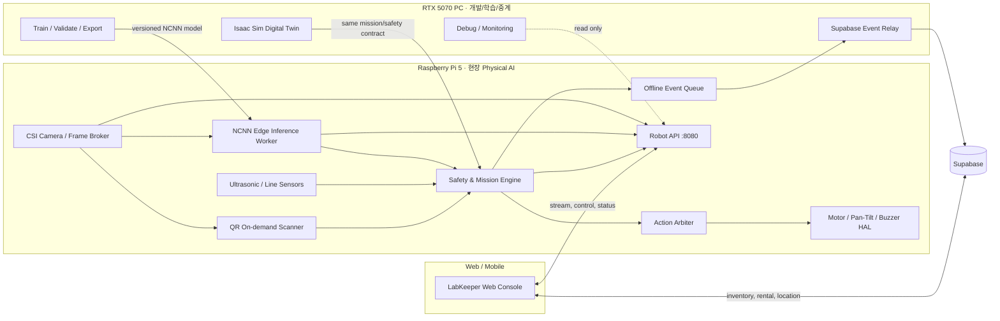

# LabKeeper Physical AI 전환 실행 기준서

> 버전: v1.1  
> 작성일: 2026-08-29  
> 적용 대상: Raspberry Pi 5 기반 실물 Raspbot, Isaac Sim, LabKeeper Web, Supabase  
> 문서 성격: **현재 상태와 목표 상태를 분리하고 실제 전환 순서를 정하는 최우선 기술 기준서**

---

## 1. 이번 전환의 결론

LabKeeper의 실물 로봇은 앞으로 **Raspberry Pi 5 안에 추론 엔진, 경량 모델, 안전 판단 엔진, 행동 우선순위 제어를 함께 넣는 Physical AI 구조**로 전환한다.

다만 “모든 시스템을 라즈베리파이에 넣는다”는 뜻은 아니다.

- **라즈베리파이 5:** 카메라·센서 입력, 엣지 추론, 안전 판단, 주행 결정, 모터/서보/부저 제어
- **RTX 5070 PC:** 모델 학습·변환·평가, Isaac Sim 실행, 개발·모니터링, 인터넷 중계
- **Web:** 대여 요청, 로봇 수동 조작, 상태 및 안전 이벤트 표시
- **Supabase:** 물품·사용자·대여·위치·안전 이벤트의 기준 데이터 저장

즉, 로봇의 현장 판단과 안전 동작은 PC 추론 서버나 인터넷이 끊겨도 계속되어야 한다. PC와 클라우드는 로봇의 두뇌가 아니라 **학습·기록·관제 도구**다.

---

## 2. 문서 우선순위

문서마다 목표 구조와 과거 구조가 섞여 있으므로 다음 순서로 해석한다.

1. **이 문서**: 전환 목표, 구현 순서, 완료 기준
2. `06_피지컬AI_전환_방향서.md`: 실물 라즈봇 사양과 측정된 환경 정보
3. `05_작업내역_및_중요사항_정리.md`: 과거 작업 기록과 운영 정보
4. `robot_architecture.md`: PC 추론 서버를 사용하던 기존 구조 참고 자료
5. `LABKEEPER_MASTER_BLUEPRINT.md`, `ARCHITECTURE_PHYSICAL_AI.md`: 개념 설계 참고 자료

기존 문서의 “YOLOv8로 교체 완료”, “로봇 단독 AI가 이미 동작함”, “PC 관제 서버 폐기 완료”라는 표현은 현재 구현 상태가 아니라 과거의 목표 표현이다. 실제 완료 여부는 이 문서의 상태표와 테스트 결과로 판단한다.

---

## 3. 현재 상태: 된 것과 아직 안 된 것

### 3.1 실물 라즈봇에서 현재 동작하는 것

- Raspberry Pi 5에서 CSI 카메라 캡처 및 `:8080` MJPEG 송출
- 전진·후진·좌회전·우회전·정지 및 카메라 팬/틸트 제어
- 초음파 장애물 거리 확인, 라인 센서, 부저 사용
- 웹 조이스틱·키보드 원격 제어와 연결 단절 시 정지 처리
- QR 코드 스캔 요청 처리
- 통합 YOLO11 NCNN 모델의 사람·연구실 물품 감지(Shadow Mode)
- 원본 스트림과 AI 추론을 분리한 단일 카메라 FrameBroker
- DB에서 동기화한 99개 물품의 로컬 위치 캐시와 고수준 안내 임무
- 부팅 시 `labkeeper-robot.service` 자동 시작과 SIGTERM 안전 종료
- 이벤트 로컬 큐 저장 및 PC 릴레이를 통한 Supabase 전달
- 순찰, 야간 경비, 장애물 대응을 위한 기본 모듈

### 3.2 아직 실물 검증이 필요한 부분

- 실제 연구실 바닥의 물품별 주행 경로와 회전량 캘리브레이션
- 실제 연구실 조명·거리·각도에서 사람/물품 오탐·미탐 데이터 수집
- 사람 클래스는 COCO 부트스트랩 데이터만 사용했으므로 자동 추적·경보 행동 비활성
- 30분 이상 연속 운용 시 온도·메모리·카메라 안정성 최종 시험
- Supabase `virtual_lab_objects`에 상세 위치 컬럼 마이그레이션 적용
- 실물 라즈봇의 경로 실행 방식 확정(현재 센서만으로 Isaac `(x, y)` 좌표 주행 불가)

### 3.3 현재 모델 성능 수치의 의미

통합 11클래스 모델의 검증 기록은 다음과 같다.

| 항목 | 기록값 |
|---|---:|
| 전체 Precision | 0.629 |
| 전체 Recall | 0.907 |
| 전체 mAP50 | 0.822 |
| 전체 mAP50-95 | 0.549 |
| 사람 mAP50 | 0.467 |
| 사람 mAP50-95 | 0.241 |

이 값은 학습 검증 세트의 성능이며, **실제 연구실 정확도를 의미하지 않는다.** 특히 사람 클래스는 COCO128 부트스트랩 61장/254 인스턴스 기반이라 자동 행동 기준으로 사용할 수 없다.

---

## 4. 목표 아키텍처

### 중요한 경계

- PC가 꺼져도 로봇의 장애물 정지, 안전 판단, 현장 경보는 동작한다.
- 인터넷이 끊기면 이벤트는 로봇에 저장하고, 연결 복구 후 릴레이한다.
- Supabase 연결이 끊겼다고 모터 제어 루프가 멈추면 안 된다.
- Web은 로봇에게 임무를 요청하지만, 위험한 명령은 로봇의 안전 엔진이 거부할 수 있다.
- Isaac Sim과 실물 로봇은 같은 임무·안전 상태 규칙을 공유하되, 센서와 구동 구현은 각각의 HAL로 분리한다.

---

## 5. 라즈베리파이 내부 실행 구조

### 5.1 한 프로세스에 모두 몰아넣지 않는다

`run_real.py`가 전체 생명주기를 관리하되, 아래 작업은 서로 기다리지 않도록 분리한다.

| 작업 | 권장 주기 | 원칙 |
|---|---:|---|
| 모터·안전 제어 | 20 Hz | AI 추론을 기다리지 않음 |
| 카메라 캡처 | 최대 30 FPS | 카메라를 여는 주체는 하나 |
| 엣지 AI 추론 | 운영 10 FPS | 최신 프레임만 사용, 지연 큐를 만들지 않음 |
| 원본 영상 송출 | 장치 상태에 맞춤 | 추론 속도와 분리 |
| QR 스캔 | 사용자 요청 시 | 대여 절차 중 우선 수행 |
| 이벤트 전송 | 비동기 | 실패 시 로컬 큐에 보존 |

카메라 프레임은 `FrameBroker`가 한 번만 캡처하고 원본 스트림, AI 워커, QR 스캐너가 최신 프레임을 공유한다. 각 기능이 카메라를 별도로 열면 충돌과 지연이 생긴다.

### 5.2 행동 우선순위

동시에 여러 명령이 들어올 때는 다음 순서를 따른다.

1. 긴급 정지, 초음파 충돌 위험, 통신 데드맨 정지
2. 수동 정지 및 안전 제어
3. QR 스캔을 위한 일시 정지
4. 현재 사용자의 물품 안내 임무
5. 다음 대여 물품 안내 임무
6. 야간 경비 대응
7. 일반 순찰 및 충전/대기 위치 복귀

여러 물품을 연속 대여할 때는 첫 물품 안내 후 홈으로 돌아가지 않는다. 임무 큐에서 다음 물품의 선반 좌표를 즉시 받아 가장 가까운 다음 목적지로 이동한다. 큐가 비었을 때만 대기 위치로 복귀한다.

### 5.3 야간 경비의 현실적인 동작

- 정지 상태에서는 움직임 감지(MOG2 등)를 AI 추론의 트리거로 활용할 수 있다.
- 로봇 또는 카메라가 움직이는 중에는 화면 전체가 변하므로 MOG2만으로 침입을 판단하지 않는다.
- 움직이는 동안에는 고정 주기 샘플링으로 사람 감지를 수행한다.
- 1차 대응은 **정지 → 카메라 방향 조정 → 부저/이벤트 기록 → 관제 알림**이다.
- 사람을 따라 이동하는 추적은 초음파 하나만으로 안전성이 충분히 검증되지 않았으므로 초기 기본 동작으로 사용하지 않는다.

---

## 6. 모델과 추론 엔진 선택

### 6.1 모델명을 먼저 고정하지 않는다

YOLOv8이 YOLO11보다 무조건 빠르다고 가정해 전체 모델을 다시 만드는 방식은 사용하지 않는다. 먼저 이미 학습된 연구실 전용 YOLO11 nano 모델을 NCNN으로 변환하여 Raspberry Pi 5에서 측정한다.

초기 원칙은 다음과 같다.

- 학습과 export는 RTX 5070 PC에서 수행
- Pi 런타임에서는 가능하면 PyTorch와 Ultralytics 전체 패키지를 사용하지 않음
- 입력 크기는 우선 `320×320`으로 측정
- 한 번에 하나의 경량 모델만 실행
- 사람과 연구실 물품을 하나의 nano 모델로 통합
- HOG는 NCNN 오류 시 보조 fallback으로만 유지
- 실제 연구실 데이터가 확보되면 같은 클래스 계약으로 재학습 후 현 모델과 비교

### 6.2 단계별 모델 전략

**현재 배포 단계 — 단일 모델 Shadow Mode**

- 연구실 10개 클래스 + 사람 1개 클래스의 YOLO11 nano를 NCNN으로 export
- Pi 5, 320 입력, 2 threads에서 순수 추론 약 25.6 FPS 측정
- 운영은 원본 영상 약 32 FPS와 20 Hz 안전 제어 및 열 여유를 위해 AI 목표를 10 FPS로 설정
- 실제 연구실 데이터를 추가 학습하기 전까지 감지 결과를 자동 추적/경보 구동에 연결하지 않음

### 6.3 모델 배포 규칙

모델 폴더에는 다음 정보를 함께 둔다.

- 모델 파일과 엔진 형식
- 클래스 순서와 이름
- 입력 크기
- 학습 데이터 버전
- export 명령과 라이브러리 버전
- 파일 SHA-256
- 검증 결과와 실제 Pi 벤치마크
- 직전 안정 버전으로 되돌리는 방법

모델 파일만 교체하고 클래스 배열을 따로 하드코딩하는 방식은 금지한다.

---

## 7. 로봇 API와 웹 전환

목표는 실물 운용 시 웹이 PC `:8081` AI 서버가 아니라 로봇 `:8080`에 직접 연결되는 것이다.

| 경로 | 역할 |
|---|---|
| `/stream` | 원본 카메라 스트림 |
| `/ai/stream` | Pi에서 그린 감지 결과 스트림 |
| `/ai/status` | 모델 버전, FPS, 지연, 온도, 최근 감지 상태 |
| `/checkout/verify` | 현재 QR/AI 대여 검증 결과 |
| `/drive` | 수동 주행 명령 |
| `/camera` | 팬/틸트 제어 |
| `/scan_qr` | QR 스캔 요청 |
| `/telemetry` | 센서, 모드, 임무, 위치 상태 |
| `/events` | 로컬 이벤트 조회/중계용 |

PC 릴레이는 로봇 AP 네트워크와 인터넷을 동시에 연결해 Supabase로 이벤트를 전송하는 역할로 남긴다. 단, 영상 추론과 안전 판단에는 참여하지 않는다.

웹 운영 경로는 Pi `:8080`으로 전환했다. `ai_vision/live_patrol_stream.py`의 `:8081` 서버는 과거 PC 비교 도구로만 남아 있으며 웹에서는 호출하지 않는다.

---

## 8. 물품 대여와 AI의 역할

대여의 기준 데이터는 Supabase의 물품 ID, QR, 카테고리, 재고, 선반·단·칸, 안내 좌표다.

1. 사용자가 웹에서 물품을 선택한다.
2. 웹은 `request_id`, `item_id`, `mission_type`만 전송한다.
3. 로봇이 로컬 위치 캐시에서 선반·단·칸과 검증된 실물 경로를 해석해 이동한다.
4. 웹과 로봇은 “몇 번째 선반, 몇 단, 어느 칸”인지 동일한 DB 값을 표시·안내한다.
5. 사용자가 물품 QR을 로봇 카메라에 보여준다.
6. QR의 물품 ID와 요청 물품 ID가 일치해야 대여를 확정한다.
7. 여러 물품이면 로봇은 현재 위치에서 다음 안내 좌표로 바로 이동한다.

AI 물체 인식은 다른 물건을 몰래 가져가거나 QR과 외형이 크게 다른 상황을 경고하는 **보조 검증**으로 사용한다. 현재 모델 정확도만으로 대여 승인·거부를 단독 결정하지 않는다. 최종 식별 기준은 QR과 DB다.

---

## 9. 구현 단계와 통과 조건

### Phase 0 — 기준선 보존과 장치 점검

- [x] 현재 Pi 파일, 설정, 모델, 서비스 백업
- [x] 남은 디스크, RAM, swap, 온도, OS/라이브러리 버전 기록
- [x] 실물 카메라·모터·초음파·부저·QR 회귀 테스트
- [x] 기존 `:8080`, PC `:8081`, Supabase 릴레이 동작 기준선 기록

**통과 조건:** 기존 기능을 되돌릴 수 있고, 이후 측정값과 비교할 기준이 남아 있다.

### Phase 1 — 모델 export와 Pi 벤치마크

- [x] 사람 포함 통합 YOLO11 연구실 모델을 NCNN으로 export
- [x] 모델 manifest와 해시 생성
- [x] Pi 전용 venv에 최소 NCNN 런타임 설치
- [x] 320 입력으로 실제 CSI 카메라 벤치마크
- [x] FPS, 평균/p95 지연, RAM, CPU, 온도 기록
- [ ] 실제 연구실 데이터로 클래스별 오탐/미탐 기록

**초기 통과 기준:** 최소 2 FPS 이상, p95 추론 지연 500 ms 이하를 우선 목표로 하되 최종 수치는 실제 측정 후 확정한다. 추론 중에도 20 Hz 안전 제어가 끊기지 않아야 한다.

### Phase 2 — Shadow Mode

- [x] Pi AI가 감지 결과만 만들고 모터 제어 권한은 갖지 않음
- [ ] 실제 연구실 검증 세트에서 현재 NCNN 기준 모델의 클래스별 결과 기록
- [ ] 벽, 바닥, 선반, 사람, 물품, 조명 변화의 오탐 사례 수집
- [ ] 30분 이상 연속 실행해 누수·과열·프레임 적체 확인

**통과 조건:** AI 실패가 주행을 멈추게 하지 않고, 실제 장면에서 허용 가능한 정확도와 지속성을 확인한다.

### Phase 3 — Pi API와 웹 연결

- [x] Pi `/ai/stream`, `/ai/status`, `/checkout/verify` 구현
- [x] 웹의 AI 경로를 `:8080`으로 전환
- [x] 원본 스트림과 수동 제어 fallback 유지
- [x] PC 브라우저에서 상태와 오류 메시지 확인
- [ ] 모바일 실기기에서 동일 시나리오 확인

**통과 조건:** PC AI 서버 없이 웹에서 영상, 제어, 상태, QR 검증을 사용할 수 있다.

### Phase 4 — 안전 엔진과 행동 연결

- [x] 감지 결과를 공통 안전/검증 입력 형식으로 통일
- [x] 수동 > 초음파 안전 > 물품 안내 > 야간경비 > 대기 우선순위 적용
- [x] 장애물은 AI와 무관하게 초음파 우선 정지
- [x] 야간 스케줄·대기 센서 트리거와 Shadow Mode 적용
- [x] 홈 복귀 없는 물품 연속 안내 임무 적용
- [x] 검증된 경로라도 실행기 미등록 시 모터를 켜지 않는 Fail-Closed 적용
- [ ] 실물 경로 방식 승인·실행기 구현·캘리브레이션 후 안내 모터 구동 검증

**통과 조건:** 오탐이나 AI 지연이 위험한 모터 명령으로 이어지지 않고, 네트워크 단절 시에도 안전하게 정지한다.

### Phase 5 — PC AI 서버 폐기

- [x] Web과 관리 페이지의 `:8081` 참조 제거
- [x] `live_patrol_stream.py`를 운영 경로에서 제외
- [x] PC는 학습·Isaac·중계·디버깅 역할만 유지
- [ ] 직전 안정 구조로 되돌리는 절차 검증

**통과 조건:** PC AI 서버를 실행하지 않아도 전체 핵심 시나리오가 통과한다.

### Phase 6 — 실제 데이터 기반 모델 개선

- [x] 정지 상태·촬영 권한·사람 동의를 강제하는 로컬 데이터 수집 도구 준비
- [ ] 승인된 실제 실험실 카메라 데이터 수집 및 개인정보 검토
- [ ] 사람 포함 단일 모델 후보 학습
- [ ] 기존 A단계 모델과 동일 조건 비교
- [ ] 성능이 실제로 개선된 경우에만 새 모델 승격

---

## 10. 코드 변경 예정 지도

아래는 방향을 고정하기 위한 예정 구조이며, 이 문서 작성 자체가 구현 완료를 뜻하지 않는다.

| 파일/모듈 | 예정 변경 |
|---|---|
| `robot-sim/run_real.py` | 워커 생명주기, 모드, 임무 큐, 행동 우선순위 통합 |
| `robot-sim/edge_inference.py` | NCNN 추론 워커 신규 작성 |
| `robot-sim/frame_broker.py` | 단일 카메라 캡처와 최신 프레임 공유 |
| `robot-sim/ai_vision/model_manifest.json` | 모델·클래스·입력·해시 관리 |
| `robot-sim/ai_vision/export_model.py` | RTX PC용 export 재현 스크립트 |
| `robot-sim/ai_vision/benchmark_edge.py` | Pi 성능·온도·정확도 측정 |
| `robot-sim/stream_server.py` | Pi AI 상태·영상·대여 검증 API 제공 |
| `robot-sim/controller.py` | 임무 큐와 `ActionArbiter` 연동 |
| `robot-sim/real_hal.py` | 기존 하드웨어 API 유지, 안전 정지 보장 |
| `robot-sim/isaac_project/*` | 같은 임무/안전 계약을 Isaac HAL에 적용 |
| `web/js/robot-console-data.js` | 운영 AI 경로를 Pi `:8080`으로 전환 |
| `web/js/admin.js` | `:8081` 상태 의존 제거 |

기존 HAL의 검증된 모터·서보 함수 서명은 특별한 이유 없이 바꾸지 않는다. 새 AI 기능은 HAL 위에 추가한다.

---

## 11. 절대 먼저 하지 않을 것

- Pi에서 모델을 학습하지 않는다.
- “YOLO라면 30 FPS”처럼 측정 전 성능을 확정하지 않는다.
- PyTorch `.pt` 모델 두 개를 Pi에서 동시에 돌리는 구조를 그대로 복제하지 않는다.
- 추론을 모터 제어 스레드나 HTTP 요청 처리 안에서 동기 실행하지 않는다.
- 현재 `run_real.py`가 AI 모듈을 import한다는 이유만으로 Physical AI 전환이 끝났다고 표시하지 않는다.
- 로봇 AP 모드에서 Pi가 Supabase에 항상 직접 연결될 것이라고 가정하지 않는다.
- 실제로 없는 OLED, 독립 4륜 제어, 메카넘 횡이동, RGB 전체 제어를 설계에 넣지 않는다.
- 안전 검증 전에 야간 침입자를 자동으로 쫓아가게 하지 않는다.
- 기존 동작 파일을 백업과 회귀 테스트 없이 삭제하지 않는다.

---

## 12. 최종 완료 기준

다음 조건을 모두 만족해야 “Physical AI 전환 완료”라고 부른다.

- [x] Pi 부팅 후 하나의 서비스 진입점으로 로봇 핵심 기능이 시작됨
- [ ] PC AI 서버와 인터넷 없이 카메라 추론, 장애물 정지, 안전 판단, 현장 경보가 동작함
- [ ] 모터 제어 20 Hz가 추론 때문에 장시간 막히지 않음
- [x] 웹이 Pi `:8080`에서 AI 영상·상태·QR 검증을 받음
- [x] 네트워크 단절 중 이벤트가 보존되고 복구 후 중계됨
- [ ] 실제 연구실 30분 이상 연속 시험에서 비정상 종료·과열·메모리 누수가 없음
- [ ] 벽과 고정 가구는 지도/거리 기반 정적 장애물로 처리되고, 사람·이동 물체와 구분됨
- [x] 여러 물품 안내 시 홈 복귀 없이 다음 좌표로 연속 임무를 구성함
- [x] QR과 DB를 기준으로 대여가 확정되고 AI는 보조 검증만 수행함
- [x] 모델 버전·클래스·성능·롤백 방법이 기록됨
- [ ] 실물과 Isaac이 같은 임무 상태 및 안전 규칙 테스트를 통과함

---

## 13. 다음 현장 작업의 정확한 범위

1. 실제 연구실 바닥에서 도크와 각 구역 앞 정지 지점을 실측한다.
2. `REAL_ROBOT_ROUTE_CALIBRATION.md`를 기준으로 라인 체크포인트 방식 또는 위치 센서 추가 방식을 확정한다.
3. 승인된 실행기로 물품별 `physical_route.segments`를 한 경로씩 저속 검증해 `verified`로 승격한다.
4. `collect_real_lab_data.py`로 촬영 권한과 사람 동의를 확인한 뒤 빈 통로·벽·가구·사람·대표 물품 데이터를 로컬 수집한다.
5. `health_monitor.py`로 30분 이상 온도, 메모리, 원본 FPS, AI FPS, 서비스 재시작을 기록한다.
6. 사람 클래스 정확도가 기준을 통과한 뒤에만 야간 경보 행동 연결을 별도로 승인한다.
